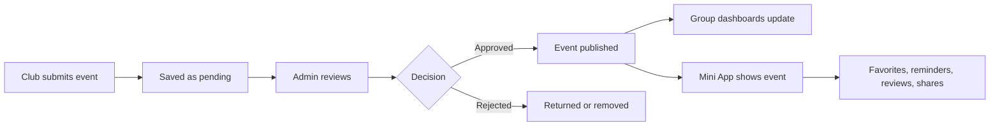

# Student Events Bot

**Student Events Bot** is a Telegram bot and Mini App for student communities to discover and share campus events — without flooding group chats.

Clubs submit events through the bot, admins approve them, and approved events appear in auto-updating dashboards pinned to connected Telegram groups. Students browse, favorite, set reminders, and coordinate attendance through the Mini App.

Built with aiogram 3, FastAPI, PostgreSQL, a vanilla JavaScript Telegram Mini App,
and a modular Flutter Events feature for the Jas Wallet host app.

---

## What it does

- **Event submission** — clubs submit events through a guided bot flow in private chat
- **Moderation queue** — admins approve, reject, or request changes before events go live
- **Group dashboards** — one auto-updating pinned message per connected Telegram group, filtered by category
- **Mini App** — search, filter, favorite, set reminders, share events, leave reviews
- **Friends** — add friends, see which friends are going to an event, share via invite links
- **NU email auth** — register and log in with a university email alongside Telegram identity
- **Admin panel** — user management, connected groups, audit logs, and stats
- **Analytics** — tracks opens, shares, registrations, favorites, and reminders per event

---

## How it works

1. A club submits an event through the bot in private chat.
2. The event is saved as pending and sent to the moderation queue.
3. An admin approves, rejects, or requests changes.
4. Approved events are published and appear in connected group dashboards.
5. Students open the Mini App to browse, favorite, set reminders, and register.



---

## Group dashboard setup

1. Add the bot to your Telegram group or channel.
2. Grant it **Delete Messages**, **Edit Messages**, and **Pin Messages** admin permissions.
3. The bot detects permissions and shows a category chooser.
4. Select the categories you want shown.
5. The bot generates and pins the dashboard automatically.
6. If the dashboard is deleted, run `/dashboard` to recreate it.

---

## Bot commands

```
/start             open the bot and see the main menu
/submit_event      start the event submission flow
/moderate          open the moderation queue (admins only)
/favorites         view favorited events
/dashboard         recreate the dashboard in a connected group
/categories        manage category filters for a connected group
/register_chat     manually register a group as a connected chat (admin)
```

---

## Tech stack

| Layer | Technology |
|---|---|
| Bot framework | aiogram 3 |
| API and web server | FastAPI + Uvicorn |
| Database | PostgreSQL + SQLAlchemy (async) + Alembic |
| Cache | Redis |
| Telegram Mini App | Vanilla JS and CSS |
| Events feature | Flutter, with the shared `app_ui` package |
| Runtime | Docker Compose |

---

## Project structure

```
events_bot/
  backend/      Python application code and Alembic migrations
  frontend/     Mini App static assets
  flutter_events/  Flutter Events feature and standalone development host
  app_ui/       Shared Flutter design system package
  docs/         product and infrastructure documentation
  .github/      CI/CD workflows
  docker/       Dockerfiles and Docker Compose files
  deploy/       deployment and healthcheck scripts
  scripts/      local utility scripts
  tests/        backend and frontend tests
```

Detailed product spec and business rules: [docs/PRODUCT.md](./docs/PRODUCT.md)

Infrastructure, setup, and deployment: [docs/INFRASTRUCTURE.md](./docs/INFRASTRUCTURE.md)

Flutter feature and Jas Wallet integration: [flutter_events/README.md](./flutter_events/README.md)

Agent coding rules: [AGENTS.md](./AGENTS.md)

---

## Local development

**Prerequisites:** Python 3.12+, Docker, Docker Compose, a Telegram bot token from [@BotFather](https://t.me/BotFather)

```bash
cp .env.example .env
# fill in BOT_TOKEN and other required values

docker compose -f docker/docker-compose.yml up -d postgres redis
cd backend
uv sync
source .venv/bin/activate
alembic -c alembic.ini upgrade head
python3 -m app.main
```

See [docs/INFRASTRUCTURE.md](./docs/INFRASTRUCTURE.md) for full setup and production deployment.
