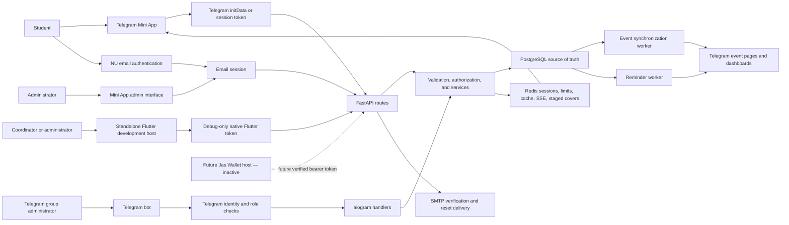

# Student Events

Student Events is a campus event platform with four current surfaces:

- a Telegram Mini App for students to discover and interact with events
- a standalone Flutter development host for coordinators to create, moderate, and manage events
- a Telegram bot for connecting groups, choosing dashboard categories, and opening event pages
- a web admin interface for users, groups, reviews, statistics, and audit history

Approved events are published to the Mini App and to auto-updating Telegram group dashboards. PostgreSQL is the durable source of truth; Redis supports sessions, rate limits, caches, realtime delivery, and staged uploads.

The Flutter feature is not connected to Jas Wallet yet. Its standalone developer authentication remains the active development setup. The Jas Wallet identity bridge exists only as an inactive future integration seam and is not configured by the production Compose file.

## Current user journeys

- Students authenticate from Telegram or with a verified `@nu.edu.kz` account, then browse, search, filter, favorite, register, share, set reminders, review, and manage friends.
- Coordinators use the standalone Flutter host in development to submit events, respond to requested changes, edit published events through a new moderation draft, and manage their events.
- Administrators use Flutter for moderation and the Mini App admin area for user, group, review, statistics, and audit operations.
- Telegram group administrators add the bot, grant the required permissions, choose event categories, and receive one pinned dashboard message.
- Background workers deliver reminders and synchronize approved event state to Telegram messages and dashboards.

Only approved, non-deleted events are visible to regular users. Event deletion is a soft retirement so append-only moderation, audit, and analytics records remain intact.

## System map



End-to-end state flow:

```text
client or Telegram update
  -> authentication and authorization
  -> FastAPI route or bot handler
  -> schema validation and rate limiting
  -> service and transaction
  -> PostgreSQL
  -> Redis invalidation or realtime signal
  -> worker and Telegram delivery when required
  -> refreshed client or Telegram-visible result
```

## Telegram group setup

1. Add the bot to a Telegram group or channel.
2. Grant Delete Messages, Edit Messages, and Pin Messages permissions.
3. Let the bot register the group and verify its permissions.
4. Choose the event categories to display.
5. The bot creates and pins the dashboard.
6. Use `/dashboard` to recreate a manually deleted dashboard and `/categories` to change filters.

Current bot commands:

```text
/start          open the bot menu
/dashboard      recreate a connected group's dashboard
/categories     manage a connected group's category filters
/register_chat  register a group manually as an administrator
```

Event submission and moderation bot routers remain in the repository for historical compatibility but are not registered at startup. The active management surface is Flutter.

## Architecture

| Layer | Technology |
| --- | --- |
| Bot | aiogram 3 |
| API and web | FastAPI and Uvicorn |
| Database | PostgreSQL, async SQLAlchemy, Alembic |
| Ephemeral state | Redis |
| Mini App | Vanilla JavaScript and CSS |
| Coordinator feature | Flutter with the local `app_ui` package |
| Runtime | Docker Compose |

```text
events_bot/
  backend/         Python application and Alembic migrations
  frontend/        Telegram Mini App assets
  flutter_events/  Flutter feature and standalone development host
  app_ui/          shared Flutter presentation package
  docs/            canonical product and infrastructure references
  docker/          development and production containers
  deploy/          deployment and health-check scripts
  tests/           backend and frontend tests
```

## Local development

Prerequisites: Python 3.12+, `uv`, Docker with Compose, Flutter for the coordinator client, and a Telegram bot token.

```bash
cp .env.example .env
docker compose -f docker/docker-compose.yml up -d postgres redis

cd backend
uv sync
source .venv/bin/activate
alembic -c alembic.ini upgrade head
python3 -m app.main
```

Run the API separately when developing the Mini App or Flutter feature:

```bash
cd backend
source .venv/bin/activate
uvicorn app.web.main:web_app --reload --host 0.0.0.0 --port 8000
```

Detailed references:

- [Product behavior and business rules](./docs/PRODUCT.md)
- [Infrastructure, deployment, and recovery](./docs/INFRASTRUCTURE.md)
- [Flutter development and future host contract](./flutter_events/README.md)
- [Repository rules](./AGENTS.md)
