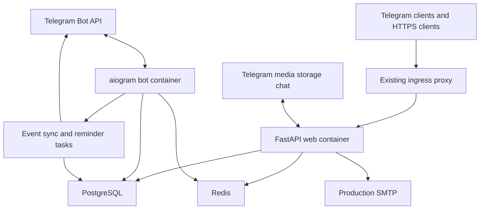

# Student Events Infrastructure

Technical architecture, configuration, deployment, and recovery reference. Product rules are in [PRODUCT.md](./PRODUCT.md).

## Runtime map



`web` serves the Mini App and API. `bot` runs Telegram polling, the event sync worker, dashboard sweeps, and reminder processing. Both use async SQLAlchemy against PostgreSQL and shared Redis. PostgreSQL is durable; Redis is recoverable support state.

The Flutter client is built outside Docker and talks to the HTTPS API. It currently uses the standalone debug host during development. Production Compose intentionally does not set `SUPERAPP_JWT_*`; Jas Wallet is not active.

## Repository layout

```text
backend/         FastAPI, aiogram, services, models, and Alembic
frontend/        Telegram Mini App static assets
flutter_events/  Flutter feature and standalone host
app_ui/          local Flutter presentation package
docker/          development and production Compose definitions
deploy/          deployment and health-check scripts
tests/           backend and frontend checks
```

Python dependencies are defined by `backend/pyproject.toml` and locked in `backend/uv.lock`. Run backend tests with the backend virtual environment, not a separate root `.venv`.

## Local setup

Prerequisites: Python 3.12+, `uv`, Docker with Compose, a Telegram bot token, and Flutter when working on the coordinator client.

```bash
cp .env.example .env
docker compose -f docker/docker-compose.yml up -d postgres redis

cd backend
uv sync --frozen
source .venv/bin/activate
alembic -c alembic.ini upgrade head
PYTHONPATH=. python3 -m scripts.seed_categories
```

Run the processes in separate terminals:

```bash
cd backend
source .venv/bin/activate
python3 -m app.main
```

```bash
cd backend
source .venv/bin/activate
uvicorn app.web.main:web_app --reload --host 0.0.0.0 --port 8000
```

For standalone Flutter development, use `LOG_LEVEL=DEBUG` and `FLUTTER_NATIVE_AUTH_ENABLED=true` only in the isolated development environment. See [flutter_events/README.md](../flutter_events/README.md).

## Production configuration

Start from [`.env.example`](../.env.example). Production requires, at minimum:

- a valid `BOT_TOKEN` and sufficiently strong `SESSION_SECRET`
- PostgreSQL and Redis URLs reachable from both application containers
- `ADMIN_IDS`, public Mini App URL settings, and trusted proxy addresses appropriate to the deployment
- a Telegram media storage chat when cover uploads are enabled
- real SMTP configuration; `EMAIL_HOST` is required by production Compose and console email is not a production delivery mode
- `LOG_LEVEL` other than `DEBUG`, with `FLUTTER_DEV_CORS`, `FLUTTER_DEV_DOCS`, and `FLUTTER_NATIVE_AUTH_ENABLED` unset or false

Do not add `SUPERAPP_JWT_*` values until the Jas Wallet cutover evidence in [SUPERAPP_BRIDGE.md](../backend/SUPERAPP_BRIDGE.md) is satisfied.

Secrets must remain in the deployment environment or secret store. Do not place real keys, tokens, passwords, verification codes, reset codes, or personal data in source, CI output, or issue reports.

## Deployment

The GitHub Actions deployment connects to the configured server checkout and runs [deploy/deploy.sh](../deploy/deploy.sh). The script:

1. validates required tools and configuration
2. fetches/builds the target application images
3. runs `alembic upgrade head` using the new image
4. starts or updates the Compose services without removing the existing containers first
5. runs readiness and migration-head checks

The application source is not modified to create cache-busting versions during deployment. Static URLs must be versioned by committed application behavior or image contents.

Production uses:

```bash
docker compose \
  --env-file .env \
  -p events_bot \
  -f docker/docker-compose.prod.yml \
  up -d --build
```

The server must already provide the external `wished_wished-app` network and route the application hostname to `events_bot_web:8000` through its ingress proxy.

## Health and readiness

- `/health` is process liveness.
- `/health/ready` verifies required dependencies and is the deployment/readiness target.
- The production web container health check requires `/health/ready` to return a ready result.
- [deploy/deploy-healthcheck.sh](../deploy/deploy-healthcheck.sh) checks readiness and verifies that Alembic reports the current revision at all heads.

A healthy process is not sufficient evidence that Telegram delivery, SMTP, or every product journey works. Those integrations need isolated staging checks.

## Migrations and rolling compatibility

- Run migrations before new containers serve traffic.
- Migrations must be additive and compatible with the currently running image during the deployment window.
- Destructive column/table changes require an expand-and-contract sequence across separate releases.
- `alembic current --check-heads` must pass after deployment.
- Never downgrade a production database automatically as part of application rollback. Roll back application code only when the migrated schema is backward-compatible; otherwise use an explicitly reviewed recovery migration.

## Workers and failure recovery

Event synchronization jobs are durable PostgreSQL rows. Workers claim them with row locks and `SKIP LOCKED`. A processing lease prevents one instance from resetting another instance's active job; jobs older than five minutes are returned to pending. Failed jobs retain attempts and error details for inspection.

Reminder rows are also claimed with row locks. Delivery success, failure, and event-driven cancellation are persisted. Telegram has no application idempotency key, so a crash after Telegram accepts a request but before the database commit can cause duplicate delivery. Later dashboard refreshes reconcile stored message state; operators should inspect failed/stale jobs rather than deleting records.

Redis loss invalidates sessions and ephemeral staged covers, interrupts SSE/pub-sub, and temporarily affects rate limiting and caches. Authentication paths fail closed with `503` when their Redis protection is unavailable. Durable event and audit state remains in PostgreSQL.

PostgreSQL unavailability makes the application unready. Services should restart through Compose after the database recovers; transaction rollback prevents partial database commits.

## Inspection and recovery

Read-only operational inspection:

```bash
docker compose --env-file .env -p events_bot -f docker/docker-compose.prod.yml ps
docker compose --env-file .env -p events_bot -f docker/docker-compose.prod.yml logs --tail=200 web bot
bash deploy/deploy-healthcheck.sh
```

Application rollback to a known compatible reference:

```bash
git checkout <known-good-reference>
bash deploy/deploy.sh
```

This does not roll the database back. Confirm migration compatibility before using it.

The repository assumes external PostgreSQL backup, restore testing, and host-level recovery procedures. It does not contain a complete automated backup system. A production owner must define retention, encryption, restore-time targets, and periodic restore drills before release.

## Verification commands

Backend:

```bash
cd backend
uv sync --frozen
PYTHONPATH=. pytest ../tests/backend
alembic -c alembic.ini current --check-heads
```

Frontend:

```bash
npm test
```

Flutter:

```bash
cd flutter_events
flutter pub get
dart format --output=none --set-exit-if-changed lib test
flutter analyze
flutter test
flutter build apk --debug
```

CI performs backend, frontend, Flutter, migration, and container checks. Passing checks demonstrate only the covered behavior; staging is still required for SMTP, Telegram permissions/rate limits, multi-instance recovery, and ingress behavior.
