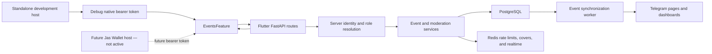

# Events Flutter feature

Flutter coordinator and administrator UI for creating, reviewing, and managing Student Events. It currently runs as a standalone development host. It has not moved to Jas Wallet, and no Jas Wallet production authentication is enabled by this repository.

## Current development state

Run the standalone host from this directory:

```sh
flutter pub get
flutter run
```

Debug builds enable the repository's standalone developer access by default. The backend must run with both settings below for native registration, login, and role switching:

```text
LOG_LEVEL=DEBUG
FLUTTER_NATIVE_AUTH_ENABLED=true
```

Disable standalone access when testing the host-session boundary:

```sh
flutter run \
  --dart-define=ENABLE_STANDALONE_DEV_ACCESS=false \
  --dart-define=API_BASE_URL=https://events.example.edu
```

`ENABLE_STANDALONE_DEV_ACCESS` is effective only in debug builds. Profile and release builds cannot activate shared test login or role switching. `TEST_USER_*` and `TEST_ADMIN_*` defines are local-development inputs and must never contain production credentials.

Release builds require an HTTPS API endpoint and keep standalone access disabled:

```sh
flutter build apk --release \
  --dart-define=API_BASE_URL=https://events.example.edu \
  --dart-define=ENABLE_STANDALONE_DEV_ACCESS=false
```

## Feature flow



The client paginates approved, owned, and pending event collections, restores its session-scoped cache on restart, invalidates stale event data after mutations, and reconnects to server updates. The backend remains authoritative for roles, ownership, moderation transitions, scheduling conflicts, and visibility.

## Package boundary

`EventsFeature` in `lib/app.dart` is the embeddable feature. `EventsApp` and `lib/main.dart` are standalone-development infrastructure and must not be mounted inside another app.

The feature owns:

- event discovery, creation, moderation, and management screens
- its internal navigation and event stores
- session-scoped cache cleanup and API retry behavior

The host owns:

- authentication and token refresh
- top-level navigation and application lifecycle
- locale, theme, and release configuration

The local `app_ui` dependency is declared as `path: ../app_ui` in `pubspec.yaml`.

## Future Jas Wallet integration

The code contains a future host-session contract, but it must remain inactive until Jas Wallet supplies an agreed issuer, audience, signing algorithm, stable subject claim, and role mapping. At that cutover, Jas Wallet is expected to mount:

```dart
EventsFeature(
  session: EventsHostSession(accessToken: jasWalletAccessToken),
  onSessionExpired: refreshJasWalletSession,
)
```

The feature calls `GET /api/flutter/auth/session`; the server verifies the host token and returns the authoritative local user and role. The feature must never infer roles or persist the host bearer token. On HTTP 401 it clears session-scoped private state and asks the host to refresh the session.

Do not set any `SUPERAPP_JWT_*` production values until the Jas Wallet contract is confirmed. See [the backend bridge reference](../backend/SUPERAPP_BRIDGE.md) for the deferred cutover checklist.

## Verification

```sh
dart format --output=none --set-exit-if-changed lib test
flutter analyze
flutter test
flutter build apk --debug
```
